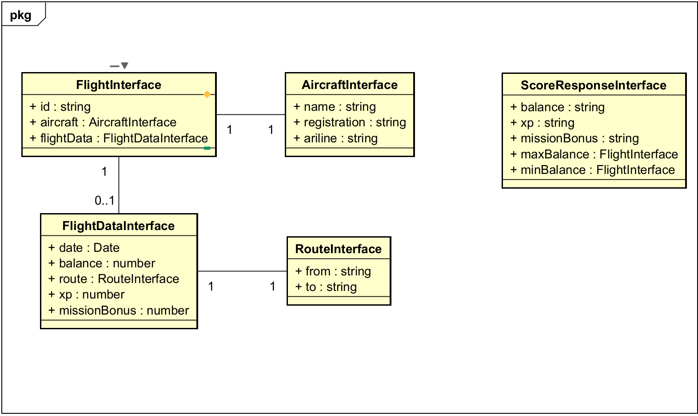
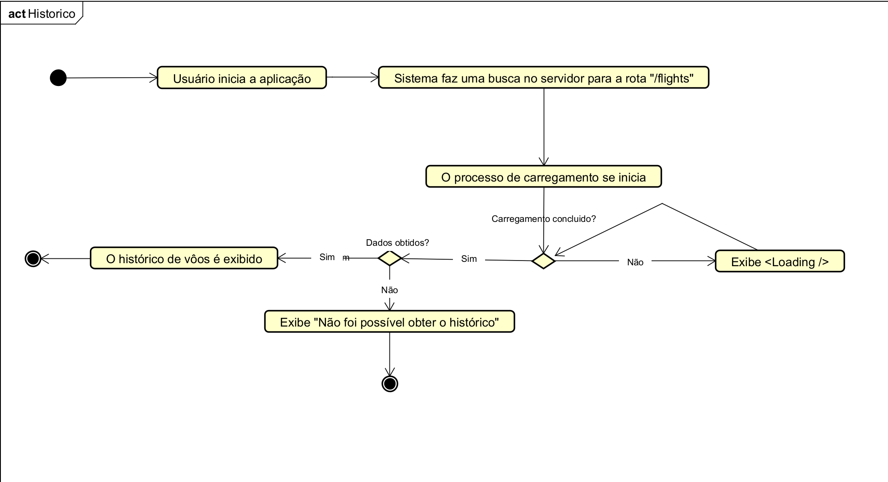
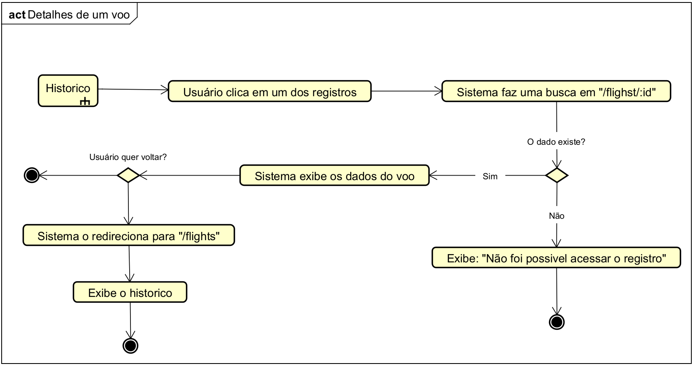
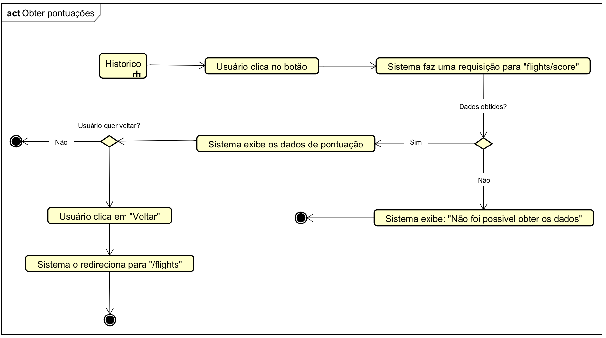

# Back-end [Desafio] Pilops
Esse proejeto consiste no backend da aplicação correspondente ao desafio proposto pela empre Pilops para a vaga de Engenheiro de Software Estágio/Júnior.

Aqui estarão, além da disponibilização do próprio backend em si, algumas das decisões técnicas tomadas durante a codificação do projeto.

## Como inicar o projeto
1. Fazer o clone do projeto
```shell
git clone https://github.com/Leonardobern10/backend_pilops
```

2. Entrar na pasta principal
```shell
cd backend_pilops
```

3. Instalar as dependências 
```shell
npm install
```

4. Definir as variáveis de ambiente
```shell
PORT=3000
CLIENT_URL=http://localhost:5173
BASE_URL=/
```

5. Executar a aplicação
```shell
npm run dev
```

**Aqui a aplicação roda em Typescript, para compilar e rodar em JS**

6. Executar build e iniciar Javascript
```shell
npm run build
npm run start
```

7. Executar os testes

*caso queira executar os testes unitários*

```shell
npm run test
```

**O servidor será iniciado em http://localhost:3000/**

Assim, o frontend conseguirá se conectar e consumir os dados.

## Modelagem
### Classes


### Historico


### Detalhes


### Pontuação


## Decisões técnicas
### Porque expressjs?
O express é um framework para geração de servidor com node. Ele ao mesmo tempo que é minimalista também traz consigo robustez, principalmente na criação de middlewares.

- Sugestão: Para projetos mais complexos talvez pudess ser utilizado NestJS, que privilegia uma orientação a objetos mais forte, bem como uma arquitetura melhor definida e limpa, separada em módulos.

### Porque representar alguns dados como interfaces?
A escolha reflete uma necessidade de melhor controle no que diz respeito ao formato em que os dados podem apresentar e funcionalidades que eles podem ter. Isso restringe possiveis alterações em seu formato, além de melhor antender casos onde eles podem se expandir, tanto em propriedades quando em metodos.

- Sugestão: Além disso, a utilização de classes permite a aplicação **DIP - Princípio da Inversão de Dependência (SOLID)** que garante facilidade na alteração do codigo já existente, desde que atenda aos requisitos impostos pela abstração ao qual deverá implementar.

### Por que utilizar cors?
Ele permite receber requisições de outra aplicação à nossa api e ainda especificar quem pode acessar nossos dados e quais os metodos HTTP permitido.

- OBS: Em nosso caso, permitimos apenas GET e restringimos os demais.

### Porque utilizar o paradigma atual?
O projeto do back-end ainda é muito simples, embora funcional, logo uma abordagem mais simplificada justifica o nivel de complexidade do projeto. Em caso de evolução e aumento de complexidade, utilizar a abordagem orientada a objetos seria mais adequada, com uma separação mais forte em camadas e responsabilidades. Segue um esboço:

```
|- src/
   |- app/
     |-- Application.ts // Classe da aplicação, utiliza middlwares e define routers
   |-- services/
     |-- FlightService.ts // Funções que chamam metodo de repository e enviam para controller
   |-- router/
     |-- FlightRouter.ts // Manipuladores de rotas definidos na aplicação (para gerenciar /fligths)
   |-- controller/
     |-- FlightController.ts // Manipuladores de requisição que interpretam e retornam req/res.
   |-- server/
     |-- Server.ts // Cuida do servidor, inicia, define porta, etc.
   |-- repository/
     |-- FlightRepository.ts // Função que interagem diretamento com o banco de dados
   |-- domain
     |-- interfaces/ // Interfaces
     |-- types/ // Tipos declarados
     |-- entities/ // Registros do banco de dados
   |-- config/
     |-- db.ts // Conexão com o banco de dados
```